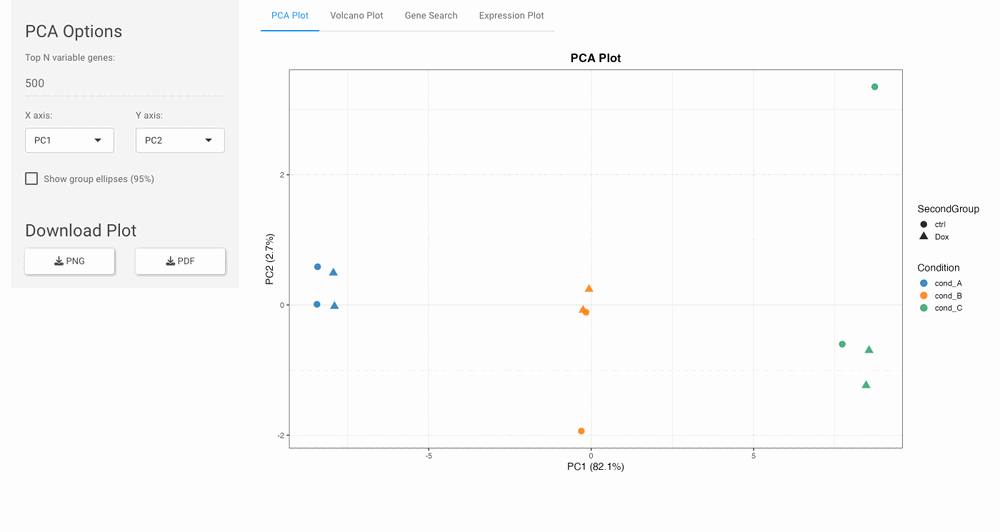
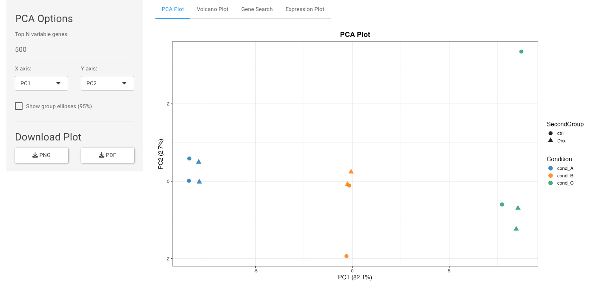
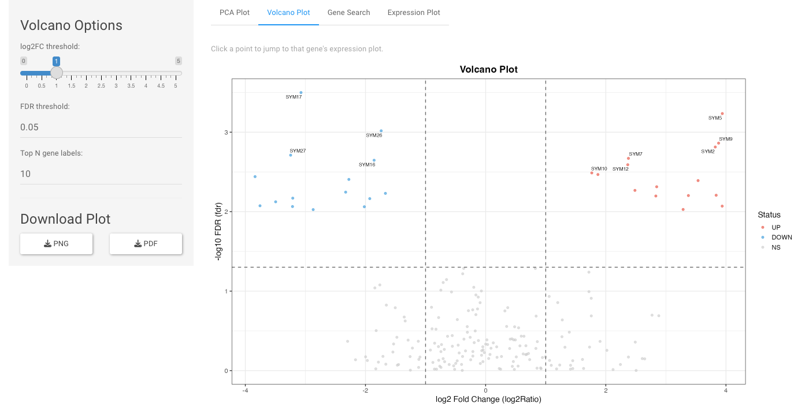
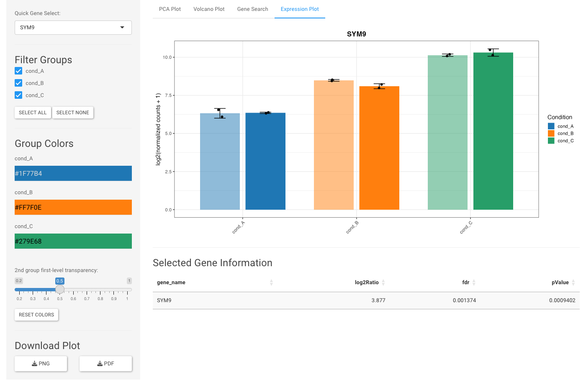

# bulk_rna_explorer


Interactive Shiny app for exploring bulk RNA-seq DESeq2/EdgeR results. Supports multiple contrasts, dynamic column mapping, expression barplots, volcano plots, and PCA plots.

<p align="center">
  
</p>
<p align="center"><em>End-to-end workflow on the bundled toy data: PCA &rarr; volcano &rarr; gene search &rarr; expression barplot.</em></p>

## Features

- **Multi-format input**: Autodetects and converts `.rds` / `.qs2` / `.qs` containers (SummarizedExperiment, DESeqDataSet, DGEList, matrix, data.frame) and `.csv` / `.tsv` / `.txt` / `.parquet` / `.feather` tables (counts matrices or DE-results) into a `SummarizedExperiment`
- **Multi-dataset support**: Load multiple files on demand, switch between contrasts
- **Dynamic column mapping**: Auto-detects assays, grouping columns, DE statistics, and gene symbols; works with any `SummarizedExperiment`
- **Expression barplots**: Mean + SD + jittered points, grouped by any `colData` column, optional second grouping
- **Volcano plots**: log2FC vs -log10(FDR) with adjustable thresholds, click-to-plot, top-gene labels
- **PCA plots**: Top-N variable genes, selectable PC axes, colored by group, shaped by optional second group
- **Gene search table**: Filterable DE statistics with click-to-plot
- **Dynamic color pickers**: One per detected group level, auto-generated palette
- **Download**: PNG and PDF for all plots

<table>
  <tr>
    <td width="33%"></td>
    <td width="33%"></td>
    <td width="33%"></td>
  </tr>
  <tr>
    <td align="center"><em>PCA: top-N variable genes, colored by group, shaped by second group.</em></td>
    <td align="center"><em>Volcano: adjustable log2FC/FDR thresholds, top-gene labels, click-to-plot.</em></td>
    <td align="center"><em>Expression: group filtering, dynamic colors, per-gene DE stats.</em></td>
  </tr>
</table>

## Quick start

```r
shiny::runApp("/path/to/bulk_rna_explorer")
```

The repo ships with two toy contrasts (`data/toy_contrast_A.rds`, `data/toy_contrast_B.rds`, ~25 KB each) you can upload from the file panel. Drop your own files alongside them, or upload via the browser.

## Data format

Internally every dataset is a **`SummarizedExperiment`** (SE). You can load that directly, or any of several common formats that are autodetected and converted to an SE on the fly:

| Format | Extensions | Holds / becomes |
|--------|------------|-----------------|
| R serialization | `.rds`, `.qs2`, `.qs` | `SummarizedExperiment`, `DESeqDataSet`, `DGEList`, `matrix`, or `data.frame` |
| Delimited text | `.csv`, `.tsv`, `.txt`, `.tab` (`.gz` ok) | Counts matrix (genes x samples) or DE-results table (delimiter and table type are sniffed) |
| Columnar | `.parquet`, `.feather` | Counts matrix or DE-results table |

A DE-results table loads with no per-sample expression, so only the Volcano and Gene Search tabs apply to it. A bare counts matrix has no sample metadata, so grouped plots have nothing to group by — start from an SE / DESeqDataSet / DGEList for grouping. Optional readers (`qs2`, `qs`, `arrow`) are only needed when you open a file of that type.

Column mapping is done in the UI, but these defaults are auto-detected:

- **Assays**: Prefers `xNorm` if present, otherwise the first available
- **Group column**: Prefers `Condition` (any categorical `colData` column works; `[Factor]` suffixes are tolerated)
- **Second group**: Prefers `Dox` (optional, for dodged barplots)
- **Gene symbols**: Detects `gene_name`, `gene_symbol`, `Symbol`, `SYMBOL`, `external_gene_name`, `hgnc_symbol`
- **DE columns**: `log2Ratio` / `log2FoldChange` for FC; `fdr` / `padj` for adjusted p-value; `pValue` / `pvalue` for raw p-value

Compatible with FGCZ Sushi DESeq2/EdgeR output and standard Bioconductor DE results. Agents (and humans) automating data prep should read [`docs/AGENT_GUIDE.md`](docs/AGENT_GUIDE.md).

### Converting files

Convert any supported file to an `.rds` SummarizedExperiment from the command line:

```bash
Rscript scripts/convert_to_se.R <input> [output.rds]
```

The same logic runs live in the app on upload, via `load_dataset()` in `R/helpers.R`.

## Requirements

Auto-installed on first run.

- **CRAN:** shiny, shinythemes, ggplot2, dplyr, colourpicker, shinyWidgets, DT, ggrepel
- **Bioconductor:** SummarizedExperiment
- **Optional (lazy):** `qs2` / `qs` to read those containers, `arrow` for `.parquet` / `.feather`. Only required when you open a file of that type; install on demand.

## Running the app

```r
# R console
shiny::runApp("/path/to/bulk_rna_explorer")
```

Or open `app.R` in RStudio and click **Run App**. The same command works on macOS, Linux, and Windows; no platform-specific setup is required beyond having R installed.

### Windows desktop shortcut

For non-technical users, double-clicking `launch_windows.bat` starts the app and opens it in the default browser. To give the shortcut a proper icon:

1. Right-click `launch_windows.bat` → **Create shortcut**
2. (Optional) Move the shortcut to the Desktop and rename it
3. Right-click the shortcut → **Properties** → **Change Icon...** → **Browse...**
4. Select `icon.ico` from the repo folder → **OK** → **Apply**

The launcher finds R on `PATH` first, then falls back to the newest install under `C:\Program Files\R\`. If R is missing it prints a message and waits for a keypress instead of flashing closed.

## Development

```bash
# Run tests
Rscript tests/testthat.R

# Convert a file (csv/tsv/qs2/qs/parquet/feather/rds) to an .rds SE
Rscript scripts/convert_to_se.R input.csv output.rds

# Regenerate toy datasets
Rscript scripts/make_toy_data.R

# Regenerate the Windows icon (requires Pillow)
python3 scripts/make_icon.py
```

CI (GitHub Actions) runs `testthat` on Ubuntu and macOS, a `lintr` check on Ubuntu, and a Shiny construction smoke test on Windows for every push and PR to `main`.

## License

MIT. See [LICENSE](LICENSE).
